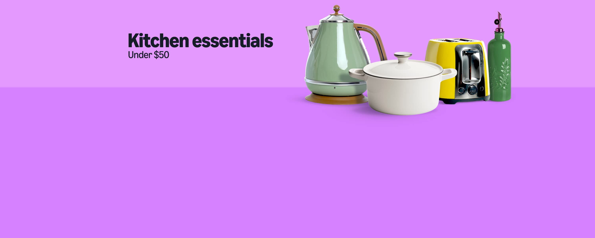

# Amazon Homepage Clone

A front-end clone of the Amazon homepage built using HTML and CSS.
Not vibe coded

## 🛠️ Technologies

- HTML5
- CSS3

## 📌 Features

- Navigation bar
- Amazon logo
- Search bar
- Hero section
- Product categories
- Product cards
- Footer

## 🎯 Purpose

This project was created to practice HTML and CSS, especially Flexbox, layouts, positioning, and styling.

## 📷 Preview

